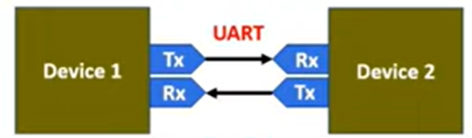

# UART Transmitter & Receiver using Verilog

## Overview

This project implements an 8-bit UART (Universal Asynchronous Receiver/Transmitter) communication system using Verilog HDL.

The design consists of a UART transmitter, UART receiver, top-level integration module, and a Verilog testbench.

The transmitter converts parallel 8-bit data into a serial UART frame. The receiver detects the incoming UART frame, samples the serial data, reconstructs the original 8-bit value, and indicates when reception is complete.

A UART loopback architecture is used, where the transmitter output is directly connected to the receiver input.

---

## Project Architecture

The design consists of a UART transmitter and receiver connected in a loopback configuration.
